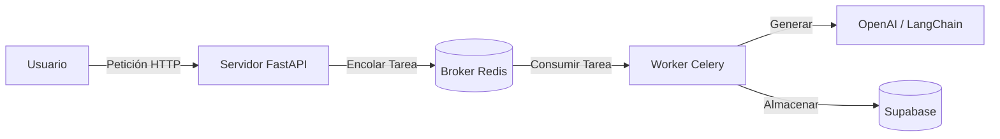

# 🚀 Lazarus Enterprise: Plataforma de Automatización de Ventas con IA

[](https://www.python.org/downloads/)
[](https://fastapi.tiangolo.com)
[](https://www.docker.com/)
[](https://opensource.org/licenses/MIT)
[](https://github.com/psf/black)
[]()

> **Solución de IA Grado Enterprise**: Escalable, Segura y Observable.
> Diseñada para la automatización de ventas de alta concurrencia utilizando LLMs.

---

## 🌟 Características Clave (Grado Enterprise)

Este proyecto no es solo un script; es una plataforma robusta construida para producción.

### 🛡️ Seguridad Primero
*   **Autenticación JWT**: Login seguro con flujo de contraseña OAuth2.
*   **Redacción de PII**: Oculta automáticamente emails/teléfonos antes de enviar datos a OpenAI (Cumplimiento GDPR).
*   **Guardrails**: Previene respuestas tóxicas o inseguras de la IA.
*   **Rate Limiting**: Protección respaldada por Redis contra DDoS (100 req/min).

### ⚡ Rendimiento y Escalabilidad
*   **Arquitectura Asíncrona**: Celery + Redis para el procesamiento de tareas en segundo plano.
*   **Caché Semántico**: `GPTCache` almacena respuestas de IA. Respuestas instantáneas para preguntas repetidas (Coste $0).
*   **Servidor de Producción**: Gunicorn con workers Uvicorn.

### 👁️ Observabilidad y Operaciones
*   **Sentry**: Rastreo de errores en tiempo real.
*   **LangFuse**: Trazabilidad completa de llamadas a LLM (coste, latencia, versionado de prompts).
*   **Infraestructura como Código**: Configuración de Terraform incluida.
*   **CI/CD**: Pipeline de GitHub Actions para pruebas automatizadas.

---

## 🏗️ Resumen de Arquitectura

El sistema sigue un patrón **Producer-Consumer** para manejar altas cargas sin bloqueos.



Para profundizar en las decisiones arquitectónicas, lee la **[Memoria Técnica](MEMORIA_TECNICA_EXPLICATIVA.md)**.

---

## 🚀 Inicio Rápido (Docker)

La forma más fácil de ejecutar el stack completo (API, Worker, Redis, Frontend).

### Prerrequisitos
*   Docker y Docker Compose
*   `OPENAI_API_KEY` en `.env`

### Pasos
1.  **Clonar el repositorio**
    ```bash
    git clone https://github.com/tu-org/lazarus-enterprise.git
    cd lazarus-enterprise
    ```

2.  **Configurar Entorno**
    ```bash
    cp .env.example .env
    # Edita .env con tus claves
    ```

3.  **Ejecutar Build de Producción**
    ```bash
    docker-compose -f docker-compose.prod.yml up --build -d
    ```

4.  **Acceder a los Servicios**
    *   **API**: `http://localhost:8000/docs`
    *   **Frontend**: `http://localhost:8501`

---

## 📚 Documentación

Creemos en la documentación como código. Consulta estas guías:

*   **[🏛️ Guía Maestra de Arquitectura](GUIA_MAESTRA_ARQUITECTURA.md)**: El viaje "De Cero a Héroe" de este proyecto.
*   **[📘 Memoria Técnica](MEMORIA_TECNICA_EXPLICATIVA.md)**: Explicación detallada de *por qué* usamos Redis, Caché Semántico, etc.
*   **[✅ Walkthrough](walkthrough.md)**: Guía de las últimas características Enterprise.

---

## 🧪 Pruebas y Evaluación

Para asegurar que la IA es inteligente y segura:

```bash
# Ejecutar Tests Unitarios
pytest

# Ejecutar Evaluación de IA (RAGAS)
# Requiere librerías pesadas de ML (PyTorch)
pytest tests/evals/test_ragas.py
```

---

## 🤝 Contribuir

1.  Haz un Fork del repositorio.
2.  Crea una rama de funcionalidad (`git checkout -b feature/funcionalidad-increible`).
3.  Haz Commit de tus cambios (`git commit -m 'Añadir funcionalidad increíble'`).
4.  Haz Push a la rama (`git push origin feature/funcionalidad-increible`).
5.  Abre un Pull Request.

---


